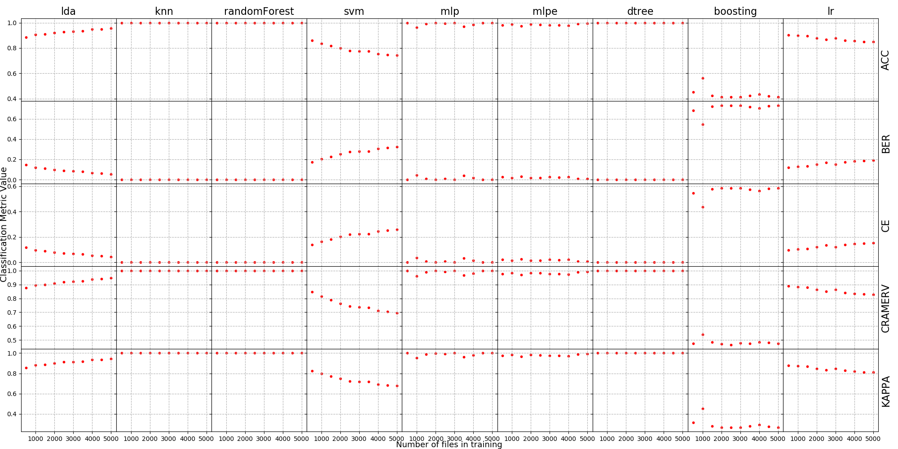
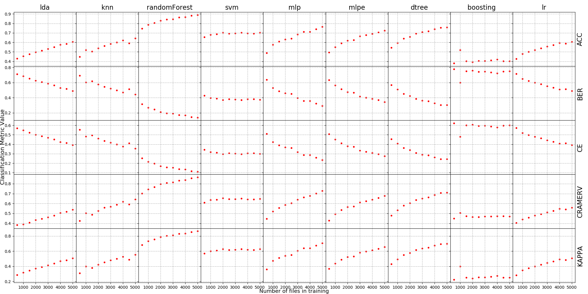
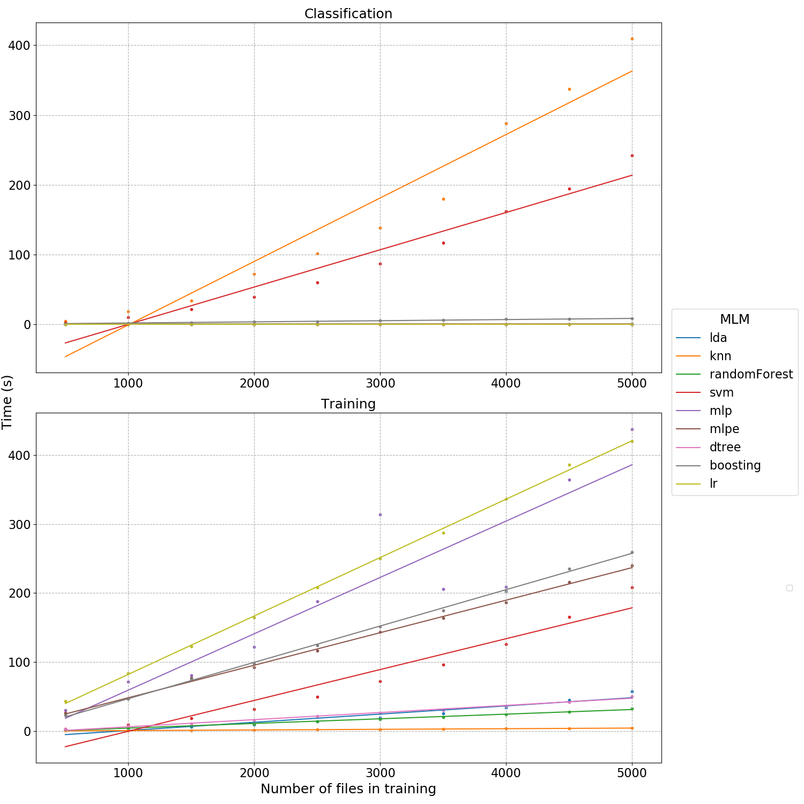

# Machine Learning Benchmark

This is the project from our DBPRO SS19 course. The goal of this project is to measure the performance of 9 machine learning algorithms on multi-class image recognition (classification) regarding the **accuracy** and **speed**. The benchmarking process is based on Pirotti et. al.'s paper [1] . The dataset we used is the [EuroSAT Dataset (RGB)](https://github.com/phelber/EuroSAT).

  #### Machine Learning Algorithms benchmarked in this program:
  * Linear Discriminant Analysis (lda)
  * K-Nearest Neighbors (knn)
  * Randome Forest (randomForest)
  * Support Vector Machine (svm)
  * Multi-Layer Perceptron (mlp)
  * Multi-Layer Perceptron Ensembled (mlpe)
  * Decision Tree (dtree)
  * Adaptive Boosting (boosting)
  * Logistic Regression (lr)
#### Accuracy Indices used in this program:
* Classification Accuracy Rate (ACC)
* Balanced Error Rate (BER)
* Classification Error Rate (CE)
* CREAMER'S V (CREAMERV)
* Cohen's kappa index (KAPPA )

## Run the program

  

To run the benchmark program, you need to download and unzip the EuroSAT Dataset (RGB) from https://github.com/phelber/EuroSAT.

  

### Prerequisites

  

To run the program, you need:

  

```

1. Python version: 3.6+
2. Libraries: numpy, sci-kit learn, matplotlib, PILLOW

```

  

### Running the benchmark

  


1. Open `main.py`, in line 85, set the `path=[path of the unzipped folder]` . (More info see the documentation in main() function)
2. Run `main.py`


## Sample Results
1. Training accuracy of models trained on different size of data.


2. Validation accuracy of models trained on different size of data.


3. Training and classification time of each machine learning algorithm on different size of training data.



## References


[1] Pirotti, F., Sunar, F., & Piragnolo, M. (2016). BENCHMARK OF MACHINE LEARNING METHODS FOR CLASSIFICATION OF A SENTINEL-2 IMAGE. ISPRS - International Archives of the Photogrammetry, Remote Sensing and Spatial Information Sciences, XLI-B7, 335–340. [https://doi.org/10.5194/isprs-archives-XLI-B7-335-2016](https://doi.org/10.5194/isprs-archives-XLI-B7-335-2016)